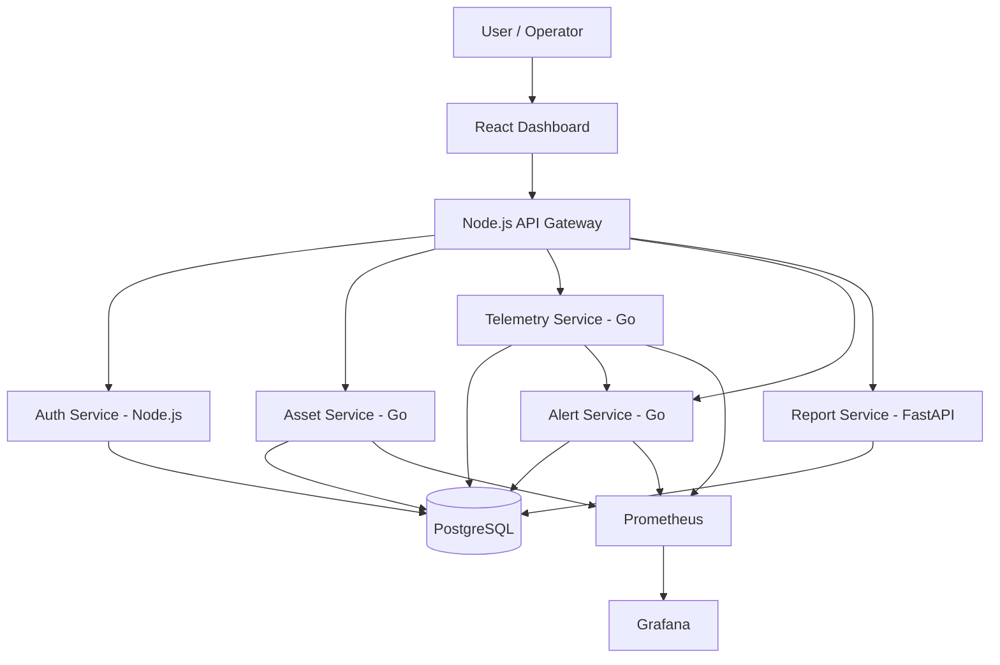
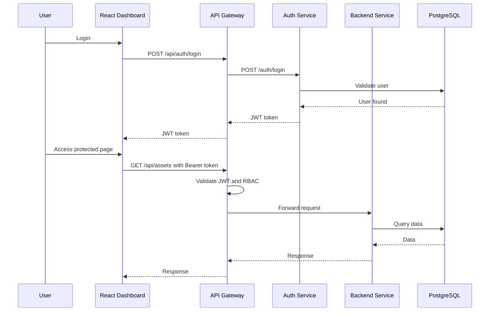
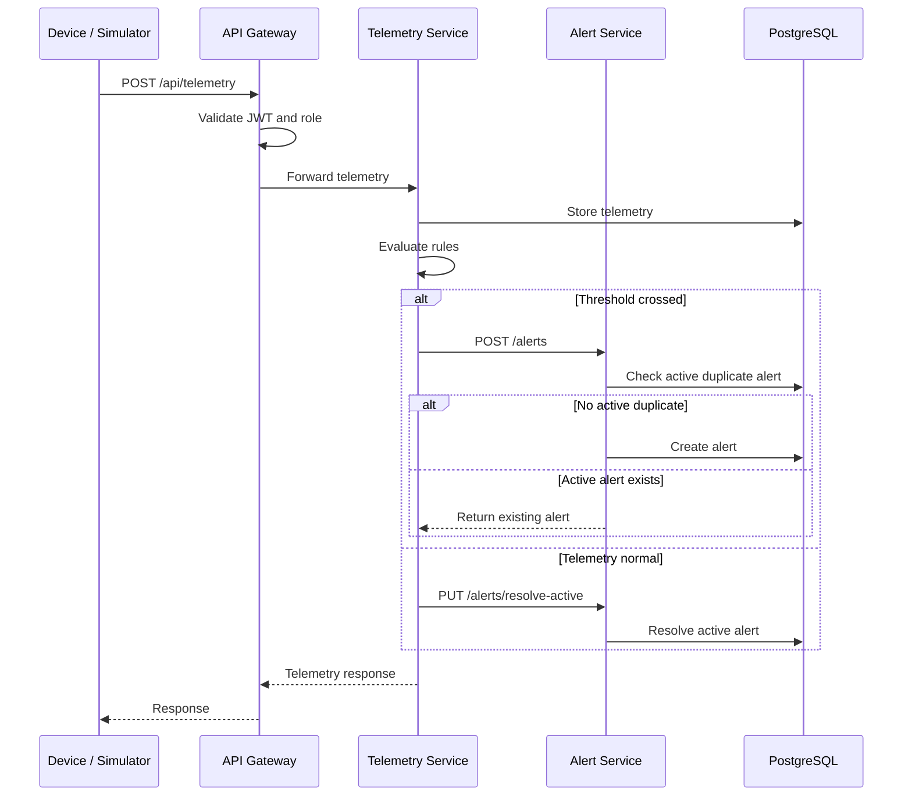
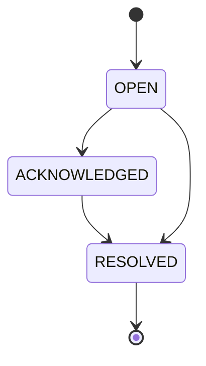
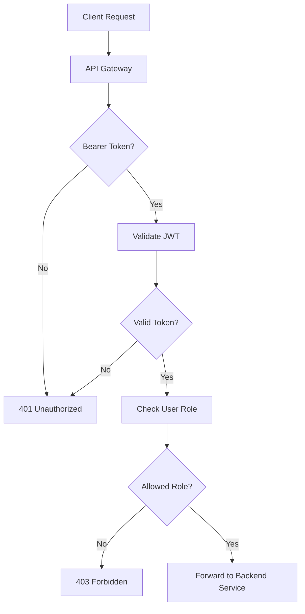
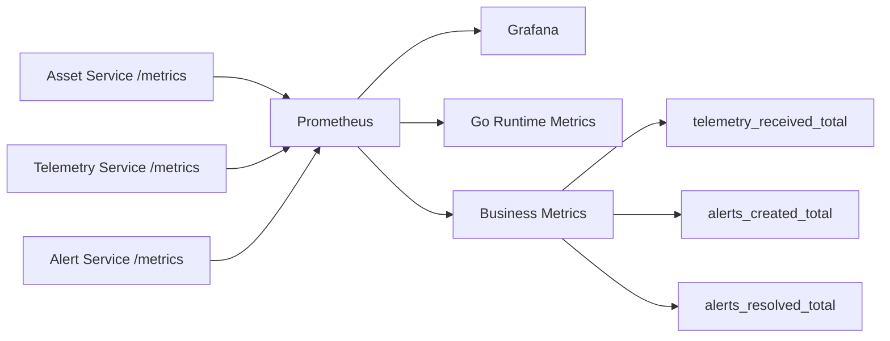
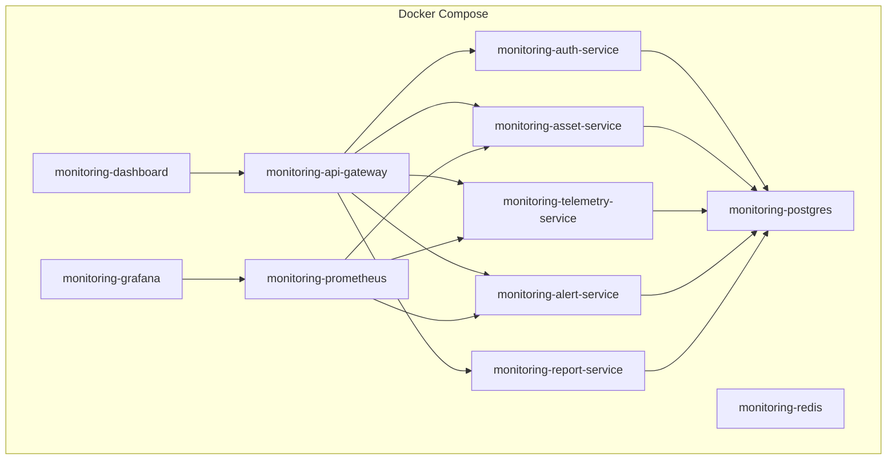

# Architecture

This document explains the architecture of the Enterprise Asset Monitoring Platform.

---

## 1. High-Level Architecture

---

## 2. Request Flow

---

## 3. Telemetry to Alert Flow

---

## 4. Alert Lifecycle

---

## 5. Security Flow

---

## 6. Observability Flow

---

## 7. Service Responsibilities

| Service | Responsibility |
|---|---|
| React Dashboard | User interface |
| API Gateway | Routing, JWT validation, RBAC, audit logging |
| Auth Service | Register, login, JWT generation |
| Asset Service | Asset CRUD |
| Telemetry Service | Telemetry ingestion and rule evaluation |
| Alert Service | Alert lifecycle, deduplication, auto-resolution |
| Report Service | Summary and reporting APIs |
| PostgreSQL | Persistent data storage |
| Prometheus | Metrics scraping |
| Grafana | Metrics visualization |

---

## 8. Deployment View

---

## 9. Production Considerations

Future production improvements:

- Kubernetes deployment
- Managed PostgreSQL
- Redis cache usage
- Kafka or RabbitMQ for event-driven communication
- OpenTelemetry distributed tracing
- Centralized logging with Loki or ELK
- Secrets Manager or Vault
- CI/CD pipeline
- Automated integration tests