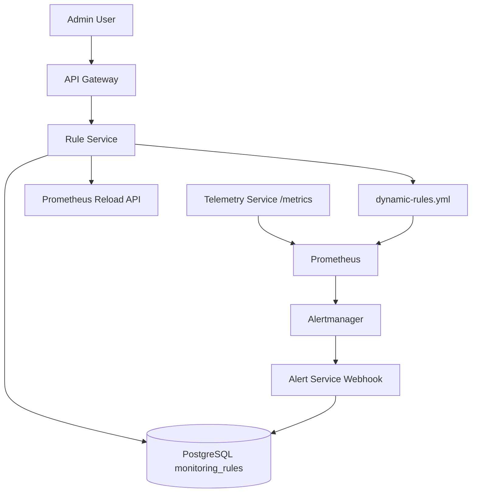

# Dynamic Monitoring Rules

Dynamic Monitoring Rules allow monitoring thresholds to be managed from the API instead of being hardcoded in the Telemetry Service.

This feature makes the platform more configurable and closer to production monitoring systems where rules can be updated without changing application code.

---

## 1. Purpose

Earlier, alert thresholds were hardcoded inside the Telemetry Service:

```text
temperature > 80
cpu > 90
memory > 90
status = DOWN
```

With Dynamic Monitoring Rules, rules are stored in PostgreSQL and managed through Rule Service APIs.

This allows ADMIN users to create, update, enable, disable, or delete monitoring rules dynamically.

---

## 2. High-Level Flow

```text
Admin / Dashboard / curl
        |
        v
API Gateway
        |
        v
Rule Service
        |
        v
PostgreSQL monitoring_rules table
        |
        v
Generate Prometheus dynamic-rules.yml
        |
        v
Reload Prometheus
        |
        v
Prometheus evaluates dynamic alert rules
        |
        v
Alertmanager sends firing/resolved webhook
        |
        v
Alert Service stores alert lifecycle
```

---

## 3. Architecture



---

## 4. Rule Model

A monitoring rule contains:

| Field | Description |
|---|---|
| `id` | Unique rule ID |
| `name` | Rule name |
| `metric` | Telemetry metric to evaluate |
| `operator` | Comparison operator |
| `threshold` | Threshold value |
| `severity` | Alert severity |
| `enabled` | Whether rule is active |
| `created_at` | Created timestamp |
| `updated_at` | Updated timestamp |

Example:

```json
{
  "name": "Dynamic High CPU",
  "metric": "cpu",
  "operator": ">",
  "threshold": 90,
  "severity": "HIGH",
  "enabled": true
}
```

---

## 5. Supported Metrics

Currently supported numeric metrics:

```text
temperature
cpu
memory
```

These map to Prometheus metrics:

| Rule Metric | Prometheus Metric |
|---|---|
| `temperature` | `asset_temperature_celsius` |
| `cpu` | `asset_cpu_usage_percent` |
| `memory` | `asset_memory_usage_percent` |

---

## 6. Supported Operators

```text
>
>=
<
<=
==
!=
```

Examples:

```text
temperature > 80
cpu >= 90
memory < 70
```

---

## 7. Rule Service APIs

All Rule Service APIs are exposed through the API Gateway.

Base URL:

```text
http://localhost:4000/api/rules
```

Direct Rule Service URL:

```text
http://localhost:5004/rules
```

For normal usage, always use the API Gateway URL.

---

## 8. Authentication

Rule APIs require JWT authentication.

Login as ADMIN:

```bash
curl -X POST http://localhost:4000/api/auth/login \
  -H "Content-Type: application/json" \
  -d '{
    "email": "admin@example.com",
    "password": "admin123"
  }'
```

Set token:

```bash
TOKEN="paste-token-here"
```

---

## 9. Create Rule

Only ADMIN can create rules.

```bash
curl -X POST http://localhost:4000/api/rules \
  -H "Content-Type: application/json" \
  -H "Authorization: Bearer $TOKEN" \
  -d '{
    "name": "Dynamic High CPU",
    "metric": "cpu",
    "operator": ">",
    "threshold": 90,
    "severity": "HIGH",
    "enabled": true
  }'
```

Expected result:

```text
Rule is saved in PostgreSQL.
dynamic-rules.yml is regenerated.
Prometheus reload API is called.
Prometheus starts evaluating the new rule.
```

---

## 10. List Rules

ADMIN, OPERATOR, and VIEWER can read rules.

```bash
curl http://localhost:4000/api/rules \
  -H "Authorization: Bearer $TOKEN"
```

---

## 11. List Enabled Rules

```bash
curl http://localhost:4000/api/rules/enabled \
  -H "Authorization: Bearer $TOKEN"
```

This returns only rules where:

```text
enabled = true
```

---

## 12. Get Rule By ID

```bash
curl http://localhost:4000/api/rules/1 \
  -H "Authorization: Bearer $TOKEN"
```

---

## 13. Update Rule

Only ADMIN can update rules.

```bash
curl -X PUT http://localhost:4000/api/rules/1 \
  -H "Content-Type: application/json" \
  -H "Authorization: Bearer $TOKEN" \
  -d '{
    "name": "Dynamic High CPU",
    "metric": "cpu",
    "operator": ">",
    "threshold": 85,
    "severity": "HIGH",
    "enabled": true
  }'
```

Expected result:

```text
Rule is updated in PostgreSQL.
dynamic-rules.yml is regenerated.
Prometheus reload API is called.
Prometheus starts evaluating updated threshold.
```

---

## 14. Disable Rule

To disable a rule, update `enabled` to `false`:

```bash
curl -X PUT http://localhost:4000/api/rules/1 \
  -H "Content-Type: application/json" \
  -H "Authorization: Bearer $TOKEN" \
  -d '{
    "name": "Dynamic High CPU",
    "metric": "cpu",
    "operator": ">",
    "threshold": 90,
    "severity": "HIGH",
    "enabled": false
  }'
```

Expected result:

```text
Rule remains in PostgreSQL but is removed from generated Prometheus rules.
```

---

## 15. Delete Rule

Only ADMIN can delete rules.

```bash
curl -X DELETE http://localhost:4000/api/rules/1 \
  -H "Authorization: Bearer $TOKEN"
```

Expected result:

```json
{
  "message": "rule deleted successfully"
}
```

After delete:

```text
dynamic-rules.yml is regenerated.
Prometheus reload API is called.
Deleted rule is no longer evaluated.
```

---

## 16. Generated Prometheus Rule

When this rule is created:

```json
{
  "name": "Dynamic High CPU",
  "metric": "cpu",
  "operator": ">",
  "threshold": 90,
  "severity": "HIGH",
  "enabled": true
}
```

Rule Service generates this Prometheus rule:

```yaml
groups:
  - name: dynamic-monitoring-rules
    interval: 5s
    rules:
      - alert: DynamicHighCPU
        expr: asset_cpu_usage_percent > 90.00
        for: 5s
        labels:
          severity: high
        annotations:
          summary: "Dynamic High CPU"
          description: "Dynamic rule Dynamic High CPU triggered for asset {{ $labels.asset_id }}"
          asset_id: "{{ $labels.asset_id }}"
          alert_name: "Dynamic High CPU"
```

Generated file path:

```text
infra/prometheus/rules/dynamic-rules.yml
```

Container path:

```text
/etc/prometheus/rules/dynamic-rules.yml
```

---

## 17. Prometheus Configuration

Prometheus loads both static and dynamic rule files:

```yaml
rule_files:
  - /etc/prometheus/rules/alert-rules.yml
  - /etc/prometheus/rules/dynamic-rules.yml
```

Prometheus lifecycle reload must be enabled:

```yaml
command:
  - "--config.file=/etc/prometheus/prometheus.yml"
  - "--web.enable-lifecycle"
```

Rule Service calls:

```text
POST http://prometheus:9090/-/reload
```

after creating, updating, or deleting rules.

---

## 18. Test Dynamic CPU Rule

Create CPU rule:

```bash
curl -X POST http://localhost:4000/api/rules \
  -H "Content-Type: application/json" \
  -H "Authorization: Bearer $TOKEN" \
  -d '{
    "name": "Dynamic High CPU",
    "metric": "cpu",
    "operator": ">",
    "threshold": 90,
    "severity": "HIGH",
    "enabled": true
  }'
```

Check generated rule file:

```bash
cat infra/prometheus/rules/dynamic-rules.yml
```

Expected:

```text
DynamicHighCPU
asset_cpu_usage_percent > 90.00
```

---

## 19. Send Telemetry to Trigger Dynamic Rule

```bash
curl -X POST http://localhost:4000/api/telemetry \
  -H "Content-Type: application/json" \
  -H "Authorization: Bearer $TOKEN" \
  -d '{
    "assetId": "dynamic-prom-motor-101",
    "temperature": 70,
    "cpu": 95,
    "memory": 50,
    "status": "RUNNING"
  }'
```

---

## 20. Verify Prometheus Metric

```bash
curl http://localhost:5002/metrics | grep asset_cpu_usage_percent
```

Expected:

```text
asset_cpu_usage_percent{asset_id="dynamic-prom-motor-101"} 95
```

---

## 21. Verify Prometheus Rule

Open:

```text
http://localhost:9090/rules
```

Expected:

```text
dynamic-monitoring-rules
DynamicHighCPU
```

Open:

```text
http://localhost:9090/alerts
```

Expected:

```text
DynamicHighCPU → Pending
DynamicHighCPU → Firing
```

---

## 22. Verify Alertmanager

Open:

```text
http://localhost:9093
```

Expected alert:

```text
DynamicHighCPU
asset_id = dynamic-prom-motor-101
severity = high
```

---

## 23. Verify Alert Service

```bash
curl http://localhost:4000/api/alerts \
  -H "Authorization: Bearer $TOKEN"
```

Expected:

```text
dynamic-prom-motor-101
Dynamic High CPU
HIGH
OPEN
```

---

## 24. Resolve Dynamic Alert

Send normal CPU telemetry:

```bash
curl -X POST http://localhost:4000/api/telemetry \
  -H "Content-Type: application/json" \
  -H "Authorization: Bearer $TOKEN" \
  -d '{
    "assetId": "dynamic-prom-motor-101",
    "temperature": 70,
    "cpu": 50,
    "memory": 50,
    "status": "RUNNING"
  }'
```

Wait around 10–20 seconds.

Then check alerts:

```bash
curl http://localhost:4000/api/alerts \
  -H "Authorization: Bearer $TOKEN"
```

Expected:

```text
dynamic-prom-motor-101
Dynamic High CPU
RESOLVED
```

---

## 25. RBAC

| Role | Create | Read | Update | Delete |
|---|---|---|---|---|
| ADMIN | Yes | Yes | Yes | Yes |
| OPERATOR | No | Yes | No | No |
| VIEWER | No | Yes | No | No |

Rule API Gateway behavior:

```text
GET    /api/rules          ADMIN, OPERATOR, VIEWER
POST   /api/rules          ADMIN only
PUT    /api/rules/:id      ADMIN only
DELETE /api/rules/:id      ADMIN only
```

---

## 26. Relation to `lems-monitoring`

This feature makes the project closer to the `lems-monitoring` monitoring and alerting model.

Similar flow:

```text
Service exposes metrics
        |
        v
Prometheus scrapes /metrics
        |
        v
Prometheus evaluates rules
        |
        v
Alertmanager receives firing/resolved alert
        |
        v
Alertmanager sends webhook
        |
        v
Alert processing service handles alert
```

In this project:

```text
Rule Service manages rules in PostgreSQL.
Rule Service generates Prometheus rule YAML.
Prometheus reloads rules dynamically.
Alertmanager sends alerts to Alert Service.
Alert Service stores alert lifecycle.
```

This mirrors the important production monitoring concept used in `lems-monitoring`:

```text
metrics exposure → Prometheus scrape → rule evaluation → Alertmanager webhook → alert processing
```

---

## 27. Current Limitations

Current Dynamic Rules support only numeric telemetry metrics:

```text
temperature
cpu
memory
```

String-based rules are not yet supported, for example:

```text
status == DOWN
```

Future enhancement:

```json
{
  "name": "Device Down",
  "metric": "status",
  "operator": "==",
  "value": "DOWN",
  "severity": "CRITICAL",
  "enabled": true
}
```

---

## 28. Future Improvements

Possible improvements:

- Add string rule support for `status == DOWN`
- Add asset-specific thresholds
- Add rule groups
- Add rule priority
- Add warning and critical thresholds
- Add dashboard UI for rule management
- Add audit trail for rule changes
- Add rule validation before saving
- Add Prometheus rule syntax validation
- Add integration tests for rule generation
- Add automatic cleanup of stale alerts
- Add rule versioning
- Add approval workflow for production rule changes

---

## 29. Interview Explanation

You can explain this feature like this:

```text
I added Dynamic Monitoring Rules to make the monitoring behavior configurable.
Instead of hardcoding thresholds in the Telemetry Service, ADMIN users can create and manage rules through APIs.

Rules are stored in PostgreSQL by the Rule Service.
The Rule Service generates Prometheus-compatible rule YAML and reloads Prometheus dynamically.
Telemetry Service exposes metrics such as asset_temperature_celsius, asset_cpu_usage_percent, and asset_memory_usage_percent.
Prometheus evaluates the generated rules and sends firing/resolved alerts to Alertmanager.
Alertmanager forwards alerts to Alert Service using a webhook.
Alert Service persists the alert lifecycle.

```